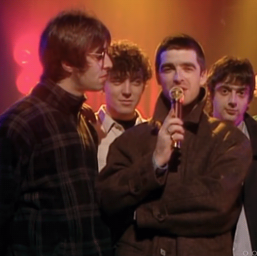
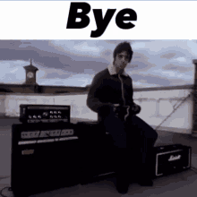

  

  

<i>Listen Oasis please ❤️</i>

<h1  align="center">Hello hello, welcome here !</h1>

  Not a bad developper but I'm not motivated and I have no idea what to do.
   
I love open source though.
   
  One day i'll start contributing to something or maybe create something. But actually I don't have time and I'm too lazy. 
   
  <i>I appreciate <b>C++</b>, <b>C#</b> and <b>Rust</b></i>

  

 

<h2>See you soon ! (no) 👋</h2>

  

 
